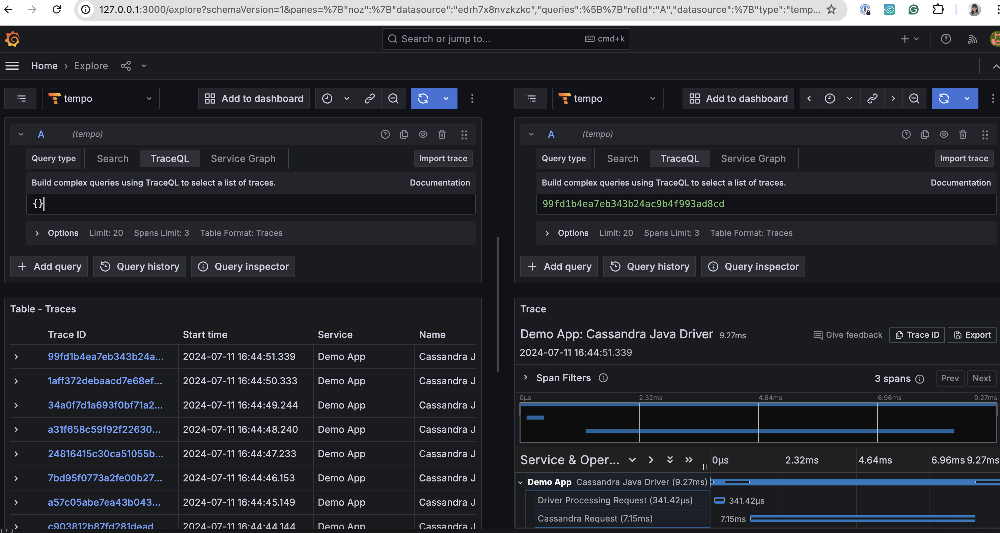

- Feature Name: Add OpenTelemetry Traces
- Start Date: 2024-12-05

# Summary
[summary]: #summary

[OpenTelemetry](https://opentelemetry.io/docs/what-is-opentelemetry/) is a comprehensive collection of APIs, SDKs, and tools designed to instrument, generate, collect, and export telemetry data (metrics, logs, and traces) to analyze software performance and behavior. 
This document outlines the necessary steps to integrate OpenTelemetry tracing into the Apache Cassandra Java driver.

# Motivation
[motivation]: #motivation

OpenTelemetry has become the industry standard for telemetry data aggregation, encompassing logs, metrics, and traces. 
Tracing, in particular, enables developers to track the full "path" a request takes through the application, providing deep insights into services. 
[OpenTelemetry's auto-instrumentation](https://github.com/open-telemetry/opentelemetry-java-instrumentation/tree/main/instrumentation/cassandra/cassandra-4.4/library) of the Apache Cassandra Java Driver (via the Java agent) already supports basic traces, logs, and metrics. 
However, this proposal to include tracing directly in the native Apache Cassandra Java Driver will eliminate the need for a Java agent and provide more detailed information, including individual Cassandra calls due to retry or speculative execution.
The OpenTelemetry support will also be invulnerable to internal API changes as it will be officially supported.

# Guide-level explanation
[guide-level-explanation]: #guide-level-explanation

## [Traces](https://opentelemetry.io/docs/concepts/signals/traces/)

Traces allow developers to understand the complete flow of a request through the system, navigating across services. Each trace consists of multiple [Spans](https://opentelemetry.io/docs/concepts/signals/traces/#spans), which represent units of work within the system. Each span includes the following details:

- Name
- Parent span ID (empty for root spans)
- Start and End Timestamps
- [Span Context](https://opentelemetry.io/docs/concepts/signals/traces/#span-context)
- [Attributes](https://opentelemetry.io/docs/concepts/signals/traces/#attributes)
- [Span Events](https://opentelemetry.io/docs/concepts/signals/traces/#span-events)
- [Span Links](https://opentelemetry.io/docs/concepts/signals/traces/#span-links)
- [Span Status](https://opentelemetry.io/docs/concepts/signals/traces/#span-status)

Spans can be correlated using [context propagation](https://opentelemetry.io/docs/concepts/signals/traces/#context-propagation).

### Example of a trace in a microservice architecture



## OpenTelemetry Semantic Conventions
[opentelemetry-semantic-conventions]: #opentelemetry-semantic-conventions

### Span name

[OpenTelemetry Trace Semantic Conventions](https://opentelemetry.io/docs/specs/semconv/general/trace/) (at the time of this writing, it's on version 1.29.0) standardizes naming conventions for various components. 
For the Apache Cassandra Java Driver, the focus is on:
* [Database Client Call Conventions](https://opentelemetry.io/docs/specs/semconv/database/database-spans/)
* [Cassandra\-Specific Conventions](https://opentelemetry.io/docs/specs/semconv/database/cassandra/)

The span name for Cassandra will follow this convention: `<db.operation> <db.name>` if the keyspace name is available. If not, it will be `<db.operation>`.

### Span attributes

This implementation will include, by default, the **required** attributes for Database, and Cassandra spans.
`server.address`, `server.port`, and `db.query.text`, despite only **recommended**, are included to give information regarding the client connection, in align with Cassandra CSharp Driver's behavior.

For a Session Request span, the following attributes will be included:

| Attribute                      | Description                                                                 | Type   | Level      | Required                                      | Supported Values                |
|--------------------------------|-----------------------------------------------------------------------------|--------|------------|-----------------------------------------------|---------------------------------|
| db.system                      | An identifier for the database management system (DBMS) product being used. | string | Connection | true                                          | cassandra                       |
| db.namespace                   | The keyspace name in Cassandra.                                             | string | Call       | conditionally true [1]                        | *keyspace in use*               |
| db.operation.name              | The name of the operation being executed.                                   | string | Call       | true if `db.statement` is not applicable. [2] | Session_Request({RequestType})  |
| db.query.text                  | The database statement being executed.                                      | string | Call       | false                                         | *database statement in use* [3] |
| db.operation.parameter.<key>   | The parameter values for the database statement being executed.             | string | Call       | false                                         | *parameter values in use*       |
| db.cassandra.consistency_level | The consistency level of the query.                                         | string | Call       | false                                         | *consistency level in use*      |
| db.cassandra.idempotence       | Whether the query is idempotent.                                            | bool   | Call       | false                                         | *true/false*                    |

A Session Request can have multiple Node Requests, due to retries and speculative executions. 
For a Node Request span, the following attributes will be included:

| Attribute                                | Description                                                                 | Type   | Level      | Required                                      | Supported Values                            |
|------------------------------------------|-----------------------------------------------------------------------------|--------|------------|-----------------------------------------------|---------------------------------------------|
| db.system                                | An identifier for the database management system (DBMS) product being used. | string | Connection | true                                          | cassandra                                   |
| db.namespace                             | The keyspace name in Cassandra.                                             | string | Call       | conditionally true [1]                        | *keyspace in use*                           |
| db.operation.name                        | The name of the operation being executed.                                   | string | Call       | true if `db.statement` is not applicable. [2] | Session_Request({RequestType})              |
| db.query.text                            | The database statement being executed.                                      | string | Call       | false                                         | *database statement in use* [3]             |
| db.operation.parameter.<key>             | The parameter values for the database statement being executed.             | string | Call       | false                                         | *parameter values in use*                   |
| db.cassandra.consistency_level           | The consistency level of the query.                                         | string | Call       | false                                         | *consistency level in use*                  |
| db.cassandra.idempotence                 | Whether the query is idempotent.                                            | bool   | Call       | false                                         | *true/false*                                |
| server.address                           | Name of the database host.                                                  | string | Connection | true                                          | e.g.: example.com; 10.1.2.80; /tmp/my.sock  |
| server.port                              | Server port number. Used in case the port being used is not the default.    | int    | Connection | false                                         | e.g.: 9445                                  |
| db.cassandra.coordinator.dc              | The datacenter of the coordinator node.                                     | string | Call       | false                                         | *datacenter name in use*                    |
| db.cassandra.coordinator.id              | The ID of the coordinator node.                                             | string | Call       | false                                         | *node ID in use*                            |
| db.cassandra.speculative_execution_count | The number of speculative executions executed.                              | int    | Call       | false                                         | *number of speculative executions executed* |

**[1]:** There are cases where the driver doesn't know about the Keyspace name. If the developer doesn't specify a default Keyspace in the builder, or doesn't run a USE Keyspace statement manually, then the driver won't know about the Keyspace because it does not parse statements. If the Keyspace name is not known, the `db.name` attribute is not included.

**[2]:** Despite not being required, this implementation sets the `db.operation` attribute even if `db.statement` is included.

**[3]:** The statement value is the query string and does not include any query values. As an example, having a query that as the string `SELECT * FROM table WHERE x = ?` with `x` parameter of `123`, the attribute value of `db.statement` will be `SELECT * FROM table WHERE x = ?` and not `SELECT * FROM table WHERE x = 123`.

## Usage

### Package installation

The OpenTelemetry implementation will be delivered as an artifact named `java-driver-open-telemetry` with the group id `org.apache.cassandra`.

### Exporting Apache Cassandra activity

Users can instantiate an `OtelRequestTracker` and pass to `CqlSession.builder().withRequestTracker`. In this way, the `java-driver-core` module does not need to include any OpenTelemetry-relevant dependency:

```java
CqlSession session = CqlSession.builder()
    .addContactPoint(new InetSocketAddress("127.0.0.1", 9042))
    .withLocalDatacenter("datacenter1")
    .withRequestTracker(new OtelRequestTracker(initOpenTelemetry()))
    .build();
```

The constructor of `OtelRequestTracker` needs an argument of `OpenTelemetry` instance. This instance will contain the configuration for the resource and the exporter.

```java
static OpenTelemetry initOpenTelemetry() {

    ManagedChannel jaegerChannel =
            ManagedChannelBuilder.forAddress("localhost", 14250).usePlaintext().build();

    JaegerGrpcSpanExporter jaegerExporter =
            JaegerGrpcSpanExporter.builder()
                    .setChannel(jaegerChannel)
                    .setTimeout(30, TimeUnit.SECONDS)
                    .build();

    Resource serviceNameResource =
            Resource.create(Attributes.of(ResourceAttributes.SERVICE_NAME, "Demo App"));

    SdkTracerProvider tracerProvider =
            SdkTracerProvider.builder()
                    .addSpanProcessor(SimpleSpanProcessor.create(jaegerExporter))
                    .setResource(Resource.getDefault().merge(serviceNameResource))
                    .build();
    OpenTelemetrySdk openTelemetry =
            OpenTelemetrySdk.builder().setTracerProvider(tracerProvider).build();

    return openTelemetry;
}
```

# Reference-level explanation
[reference-level-explanation]: #reference-level-explanation

## java-driver-open-telemetry module

### Dependencies

Similar to the existing query builder feature, this functionality will be packaged in a module named `java-driver-open-telemetry` that will handle the spans' generation.\
`java-driver-open-telemetry` will include the following dependencies:

```xml
<dependencyManagement>
    <dependencies>
        <dependency>
            <groupId>${project.groupId}</groupId>
            <artifactId>java-driver-bom</artifactId>
            <version>${project.version}</version>
            <type>pom</type>
            <scope>import</scope>
        </dependency>
        <dependency>
            <groupId>io.opentelemetry</groupId>
            <artifactId>opentelemetry-bom</artifactId>
            <version>${version.opentelemetry}</version>
            <type>pom</type>
            <scope>import</scope>
        </dependency>
    </dependencies>
</dependencyManagement>
<properties>
    <version.opentelemetry>0.15.0</version.opentelemetry>
</properties>
<dependencies>
    <dependency>
      <groupId>io.opentelemetry</groupId>
      <artifactId>opentelemetry-api</artifactId>
    </dependency>
    <dependency>
      <groupId>io.opentelemetry</groupId>
      <artifactId>opentelemetry-sdk</artifactId>
    </dependency>
    <dependency>
      <groupId>io.opentelemetry</groupId>
      <artifactId>opentelemetry-exporter-jaeger</artifactId>
    </dependency>
</dependencies>
```

### OtelRequestTracker

`OtelRequestTracker`'s constructor needs an argument of `OpenTelemetry` instance, which contains configuration information.

`OtelRequestTracker` implements the `RequestTracker` interface and will be responsible for creating spans for each request.

After [PR-1](https://github.com/lukasz-antoniak/cassandra-java-driver/pull/1) and [PR-1949](https://github.com/apache/cassandra-java-driver/pull/1949) are merged, the `RequestTracker` interface will include:

```java
void onSessionReady(@NonNull Session session) {}
        
void onRequestCreated(
    @NonNull Request request,
    @NonNull DriverExecutionProfile executionProfile,
    @NonNull String requestLogPrefix) {}

void onRequestCreatedForNode(
    @NonNull Request request,
    @NonNull DriverExecutionProfile executionProfile,
    @NonNull Node node,
    @NonNull String requestLogPrefix) {}

void onSuccess(
    long latencyNanos, @NonNull ExecutionInfo executionInfo, @NonNull String requestLogPrefix) {}

void onError(
    long latencyNanos, @NonNull ExecutionInfo executionInfo, @NonNull String requestLogPrefix) {}

void onNodeSuccess(
    long latencyNanos, @NonNull ExecutionInfo executionInfo, @NonNull String requestLogPrefix) {}

void onNodeError(
    long latencyNanos, @NonNull ExecutionInfo executionInfo, @NonNull String requestLogPrefix) {}
        
void close(){}
```

`OtelRequestTracker` will utilize the above methods.

1. `OtelRequestTracker` will initialize OpenTelemetry exporter on `onSessionReady`. 
2. It will create a parent span of operation name `Session Request` on `onRequestCreated`, and create a child span of operation name `Node Request` on `onRequestCreatedForNode`, including the database calls for retries and speculative executions. 
3. It will end all the spans in this `Session Request` on `onSuccess`, `onError`, `onNodeSuccess`, or `onNodeError`.
4. It will release all the resources on `close`.

# Rationale and alternatives
[rationale-and-alternatives]: #rationale-and-alternatives

## Not using `opentelemetry-semconv` package

The [semantic conventions](https://opentelemetry.io/docs/specs/semconv/) are a fast evolving reference that "define a common set of (semantic) attributes which provide meaning to data when collecting, producing and consuming it.".\
While the package [`opentelemetry-semconv`](https://github.com/open-telemetry/semantic-conventions-java) (current version 1.29.0-alpha) can simplify semantic convention updates, it is still marked as non-stable and therefore is not included in this proposal.

# Prior art
[prior-art]: #prior-art

OpenTelemetry has [instrumentation](https://github.com/open-telemetry/opentelemetry-java-instrumentation/tree/main/instrumentation/cassandra/cassandra-4.4/library) for Apache Cassandra Java Driver, but it requires the user to run the Java agent.
Apache Cassandra C# driver already provides [native support](https://docs.datastax.com/en/developer/csharp-driver/latest/features/opentelemetry/index.html) for OpenTelemetry tracing. 

Apache Cassandra also has client-side implementations in other languages in the form of contribution projects:

- [NodeJS](https://github.com/open-telemetry/opentelemetry-js-contrib/tree/main/plugins/node/opentelemetry-instrumentation-cassandra)
- [Python](https://github.com/open-telemetry/opentelemetry-python-contrib/tree/main/instrumentation/opentelemetry-instrumentation-cassandra)

There are other DBMS implementations regarding the export of telemetry data in client-side calls in the java ecosystem:

- [MongoDB](https://github.com/open-telemetry/opentelemetry-java-instrumentation/tree/main/instrumentation/mongo) 
- [Elasticsearch](https://github.com/elastic/elastic-otel-java)

# Future possibilities
[future-possibilities]: #future-possibilities


## Include configuration options

Future updates could introduce customizable configuration options for exporters, sampling, and span attributes via Typesafe configuration.
For example, we could support the following option to disable the `db.statement` span attribute:

```
datastax-java-driver {
  advanced {
      open-telemetry {
          attributes {
              db.statement = false
          }
      }
  }
}

```

## Adopt `opentelemetry-semconv` and include missing recommended attributes

When `opentelemetry-semconv` becomes stable, the project can adopt it to simplify semantic convention updates.

As referred in [*semantic conventions* section](#opentelemetry-semantic-conventions), there are recommended attributes that are not included in this proposal that may be useful for the users of Cassandra telemetry and can be something to look at in the future:

- [Cassandra Call-level attributes](https://opentelemetry.io/docs/specs/semconv/database/cassandra/#call-level-attributes)
- [Database Call-level attributes](https://opentelemetry.io/docs/specs/semconv/database/database-spans/#call-level-attributes)
- [Database Connection-level attributes](https://opentelemetry.io/docs/specs/semconv/database/database-spans/#connection-level-attributes)

## Metrics and logs

As the industry is moving to adopt OpenTelemetry, this project could eventually support metrics and logs, although the [semantic conventions for database metrics](https://opentelemetry.io/docs/specs/semconv/database/database-metrics/) are still in experimental status.